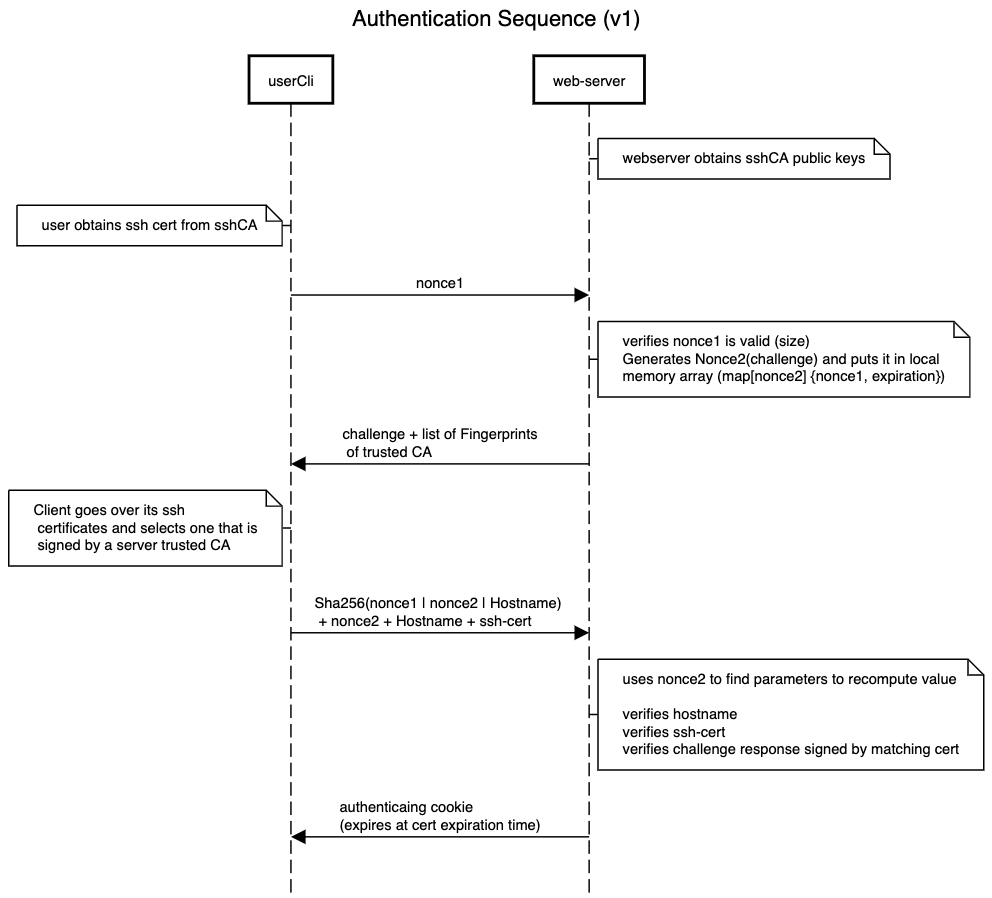

# webauth ssh-cert

Demo/Design for webauth using  for ssh certs using the ssh agent.

The motivation is on having SSO for CLI utilities without the need of generating identity/authentication tokens that can be reused by misbehaving servers. The other goal is to reduce the number of cli operations needed by clients.

Right now it is a work in progress and no implications of its security are given.

The V1 of the procol is as Follows:

Objectives:
1. Avoid use of password
2. Use of an already contained ephemeral credential
3. Must happen all within the HTTP layer (to handle LB terminated TLS connections)
4. Prevention of Replay attacks
5. When using certificates no need to for external dependencies for checking auth (use the sshCA as trust anchor)
6. Prevention of revealing of secrets from either the server or the client.
7. Must be able to run error free for well behaved clients and servers (no probabilitic fails)

OpenQuestions (v1):
1. Currently we send back the full list of sha256 fingerprints of the trusted certs. This has the advantage of just being computed once, but has the disavantage that we are giving the complete fingerprint to an attacker.
2. We send nonce1 on the first leg of the transmission, the goal is to be able to bind the two transactions. Is this even necesary?

### FAQ:
#### Why not SSL certificates?
Many server services are found behind TLS terminating load balancers.
#### Have you looked auth webauth protocol?
Yes the handshake is very inspired by that prococol. However one of the issues we wanted to avoid is the requirement of establishing long term keys between the client and each of the servers.
